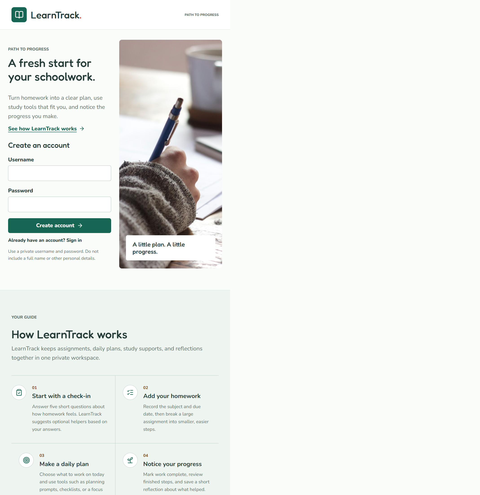
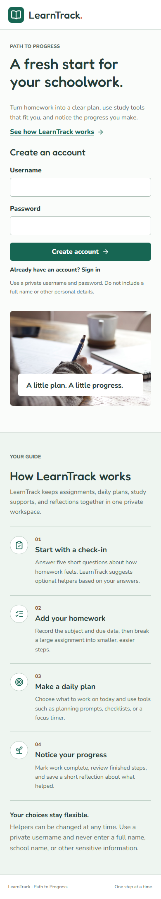

# LearnTrack User Guide

LearnTrack is a private homework workspace that helps a learner turn assignments into manageable daily actions. It combines a short study check-in, homework tracking, optional learning helpers, a daily plan, and progress reflection.

## Getting Started

1. Open [LearnTrack](https://ltrack-f7aeb.web.app/).
2. Create an account with a private username and a password of at least six characters.
3. Do not use a full name, school name, email address, or other sensitive information as the username.
4. Complete the five-question study check-in.
5. Review the suggested helpers and select **Save my helpers**.

The check-in does not grade or diagnose the learner. It only suggests tools that may make homework easier to approach. Helpers can be changed later from **My helpers**.

## My Homework

**My homework** is the main assignment list.

- Select **Add homework** to enter a title, subject, and optional due date.
- Enable **Small steps** to split an assignment into manageable actions.
- Choose a starter set for common work such as a book report or test preparation, or write custom steps.
- Use the circle beside an assignment to mark all of it complete.
- Use **To do**, **Done**, and **All** to filter the list.
- Use the pencil button to edit an assignment and the trash button to delete it.

When every step is checked, the assignment is completed automatically. Reopening any step moves the assignment back to **To do**.

## My Plan

**My plan** answers the question, “What will I work on today?”

1. Select a date.
2. Add unfinished homework to that day.
3. If **Plan ahead** is enabled, assign individual steps to specific days.
4. Remove work from a day without deleting the assignment.

Due dates describe when work is expected. Planned dates describe when the learner intends to work on it.

## My Helpers

The toolbox contains optional supports:

- **Homework checklist** keeps assignments and due dates together.
- **Small steps** breaks large work into smaller actions.
- **My first task** helps choose what to begin first.
- **Focus timer** provides a short work session followed by a break.
- **Plan ahead** assigns individual steps to future days.

Open **My helpers** to enable or disable tools, or choose **Retake my check-in** to get new suggestions.

## My Progress

**My progress** summarizes finished homework, unfinished homework, and completed steps. The daily reflection records how homework felt and what helped. Reflections can be updated for the current day and remain private to the signed-in account.

## Privacy And Accounts

- Each account can read and change only its own Firestore documents.
- Use a private username rather than identifying student information.
- Do not share passwords.
- Sign out when using a shared device.
- The current username-based account system does not include password recovery. Keep the password somewhere appropriate and secure.

## Mobile Use

LearnTrack adapts to phone-sized screens. The four workspace destinations appear across the top, forms use full-width controls, and the same homework, planning, helper, and reflection features remain available.

## Troubleshooting

- **Account creation fails:** Confirm Email/Password is enabled in Firebase Authentication and that the password has at least six characters.
- **Username already exists:** Select **Already have an account? Sign in** or choose another private username.
- **Workspace does not load:** Check the internet connection and refresh the page.
- **A change is not visible:** Wait for the save message, then refresh once.
- **Password is forgotten:** This version has no password recovery flow; create a new account or ask the application owner for support.
